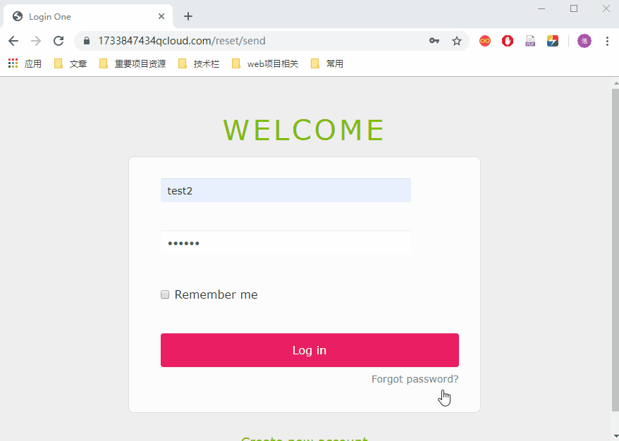
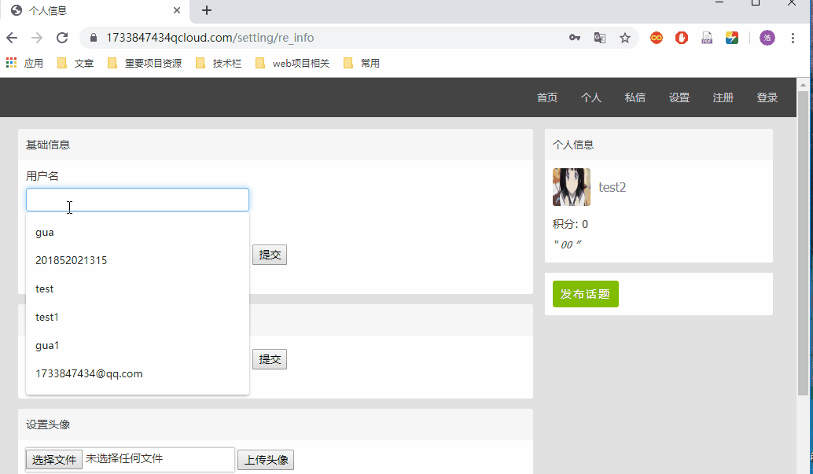
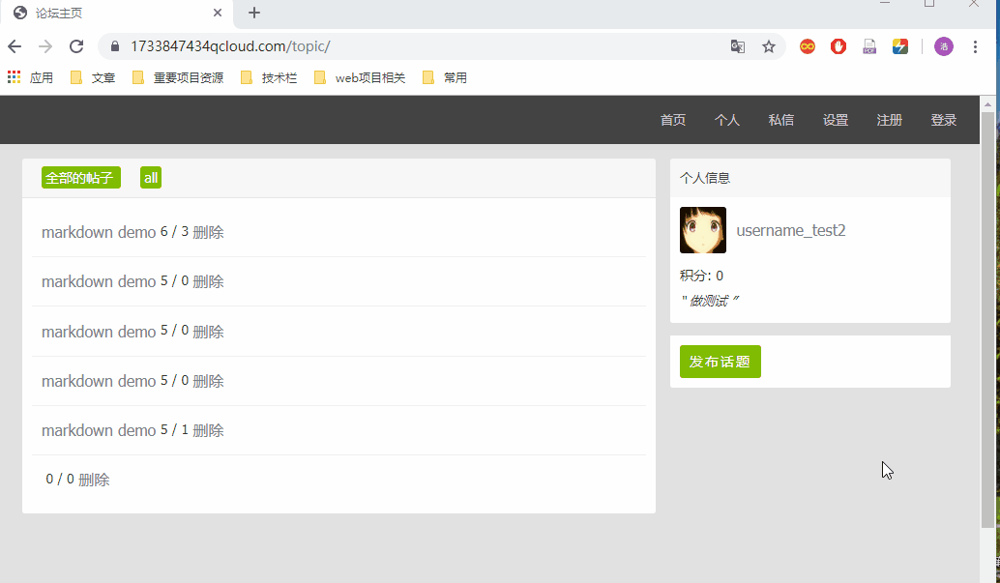
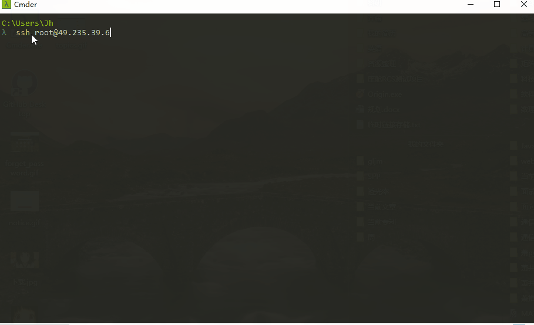

# Flask 论坛

## 功能介绍
- 实现了用户的注册、登录、验证及其个人信息页的管理；
- 个人主页的发布或参与话题的管理；
- 利用邮件验证实现了用户密码找回功能；
- 实现了对贴子的发布、删除、评论以及板块化管理；
- 实现站内信的邮件通知功能以及评论中的 @ 邮件提醒。

## 功能演示
### 1.密码找回

  
### 2.站内信的邮件通知功能，以及评论中的 @ 邮件提醒

### 3.个人信息页的管理

### 4.用户发帖管理的管理

### 5.一键部署

## 论坛配置优化
- 在性能方面，
  - 本项目实现了 ORM 性能优化，其中论坛数据存储使用MySQL，针对需要频繁读取的数据使用 Redis 进行了缓存优化。
- 在安全方面：
  - 本项目使用了云服务器硬件防火墙、ubuntu 内置软件防火墙、Nginx 反向代理、密码加盐、XSRF token 防御等多级手段提高安全性，保障用户数据的安全。 
  - 实现了利用异步消息队列处理站内信的邮件发送，实现了对重要信息的防丢失功能。

